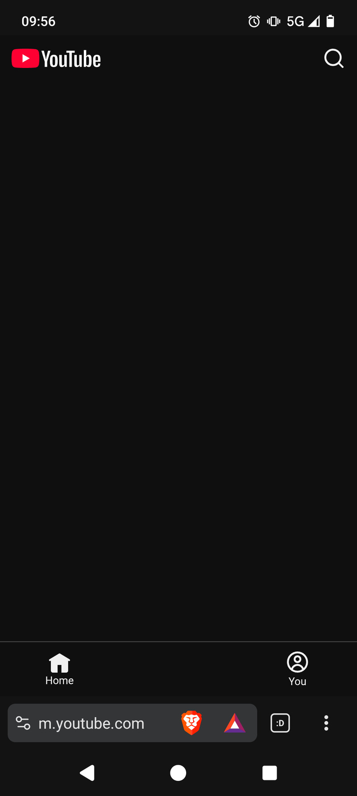

# Degoogle-Quit-YouTube
How I finally achieved this after much pain and elapsed time

OK so today a lot of products and services are made to be "craveable" so let's not spend long blaming and shaming.
Obviously YouTube is an almost frictionless experience with endless fascinating content - but endless scroll is endlessly long and life is not.
I personally find this kind of thing to be a problem if I have it available but if it isn't really around then I won't go looking for it.
But it is notoriously difficult to get rid of YouTube and - and - it is genuinely useful and really good if you want to see how to do something.

I wanted to get Graphene OS originally but Pixels are pretty expensive, I got a different phone at one point, one Samsung Galaxy version, I think - a supported version but then it was a later model and had a keyed bootloader so you couldn't sideload. Irritating, that eventually died, my friend gave me a Realme One + - great phone, lasted years, died to a fall.
Then I went and bought a Fairphone 6 with e/OS preinstalled. €600. I'm not super into phones and cameras and stuff but it hasn't let me down yet and I've treated it quite roughly. I do miss having a 3.5mm stereo jack.

Not only is e/OS Android without google - with support and updates - but when you use Brave browser, you can go into the settings (Brave Shields & privacy) and turn off the more invasive parts of YouTube such as shorts.

This is what my YouTube looks like on the phone.

What I learned is that the suggestion algorithm seems to be the main problem for me. There's always the next thing to look at. As it is now, I can search for whatever I want - it's all there but it's on pull instead of push.

I have a separate device - an old Samsung Xperia tablet that I got given - for google account and gmail etc. The other interesting thing is that it's maybe 10 years old and the gmail app crashes it if you ask too much of it. Ray Tomlinson sent the first email over ARPANET in 1971, this Xperia has probably far more power than that entire network. That's more than a little bit of bloat, I mean I might forgive it if the spam filter was doing good work.

In summary, I am completely satisfied with this course of action. Sometimes it's ok to just spend the money to get something done and that's what I did.
